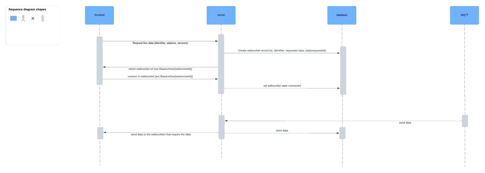

# Frontend requesting live data flow example



# Database structure
## "stations" table
| column | PK | FK | type | nullable | auto increment |
| :----: | :----: | :----: | :----: | :----: | :----: |
| id | yes | no | string | no | no |
| latitude | no | no | double | no | no |
| longitude | no | no | double | no | no |
| name | no | no | string | yes | no |
| description | no | no | string | yes | no |

## "sensors" table
| column | PK | FK | type | nullable | auto increment |
| :----: | :----: | :----: | :----: | :----: | :----: |
| id | yes | no | int | no | yes |
| type | no | no | string | no | no |
| unit | no | no | string | no | no |

## "measurements" table
| column | PK | FK | type | nullable | auto increment |
| :----: | :----: | :----: | :----: | :----: | :----: |
| timestamp | yes | no | datetime | no | no |
| station_id | yes | stations(id) | string | no | no |
| sensor_id | yes | sensors(id) | int | no | no |
| sensor_value | no | no | string | no | no |
## "station_sensors" table
| column | PK | FK | type | nullable | auto increment |
| :----: | :----: | :----: | :----: | :----: | :----: |
| station_id | yes | stations(id) | string | no | no |
| sensor_id | yes | sensors(id) | int | no | no |

# API endpoints
## basic API response structure
**succes response:**
```json
{
  "status": "success",
  "message": "Station location updated successfully.",
  "data": {
    "staionId": "WSTATION-XXXXXXXX",
    "location": {
      "latitude": "XX.XXXXXX",
      "longitude": "XX.XXXXXX"
    }
  }
}
```
**error response:**
```json
{
  "status": "error",
  "message": "Invalid station ID.",
  "errors": [
    {
      "field": "stationId",
      "issue": "The station ID provided does not exist."
    }
  ]
}
```
**pagination response:**
```json
{
  "status": "success",
  "message": "Stations retrieved successfully.",
  "data": [
    {
	    "staionId": "WSTATION-XXXXXXXX",
      "location": {
        "latitude": "XX.XXXXXX",
        "longitude": "XX.XXXXXX"
      },
      "name": null,
      "description": null
    },
    {
	    "staionId": "WSTATION-XXXXXXXX",
      "location": {
        "latitude": "XX.XXXXXX",
        "longitude": "XX.XXXXXX"
      },
      "name": null,
      "description": null
    },
    ...
  ],
  "meta": {
    "total": 100,
    "page": 1,
    "perPage": 10,
    "totalPages": 10
  }
}
```
## GET baseurl/api/v1/stations
**success response:**
```json
{
  "status": "success",
  "message": "Stations retrieved successfully.",
  "data": [
    {
      "staionId": "WSTATION-XXXXXXXX",
      "location": {
        "latitude": "XX.XXXXXX",
        "longitude": "XX.XXXXXX"
      },
      "name": null,
      "description": null
    },
    {
      "staionId": "WSTATION-XXXXXXXX",
      "location": {
        "latitude": "XX.XXXXXX",
        "longitude": "XX.XXXXXX"
      },
      "name": null,
      "description": null
    },
    ...
  ],
  "meta": {
    "total": 100,
    "page": 1,
    "perPage": 10,
    "totalPages": 10
  }
}
```
## GET baseurl/api/v1/stations/{stationId}
**success response:**
```json
{
  "status": "success",
  "message": "Station retrieved successfully.",
  "data": {  
    "staionId": "WSTATION-XXXXXXXX",
    "location": {
      "latitude": "XX.XXXXXX",
      "longitude": "XX.XXXXXX"
    },
    "name": null,
    "description": null,
    "sensors": [
      {
        "id": X,
        "type": "temperature",
        "unit": "celsius"
      },
      ...
    ]
  }
}
```
## GET baseurl/api/v1/stations/{stationId}/location
**success response:**
```json
{
  "status": "success",
  "message": "Station location retrieved successfully.",
  "data": {  
    "staionId": "WSTATION-XXXXXXXX",
    "location": {
      "latitude": "XX.XXXXXX",
      "longitude": "XX.XXXXXX"
    }
  }
}
```
## GET baseurl/api/v1/stations/{stationId}/sensors
**success response:**
```json
{
  "status": "success",
  "message": "Station sensors retrieved successfully.",
  "data": {
    "staionId": "WSTATION-XXXXXXXX",
    "sensors": [
      {
        "id": X,
        "type": "temperature",
        "unit": "celsius"
      },
      ...
    ]
  }
}
```
## GET baseurl/api/v1/stations/{stationId}/measurements
**query parameters:**
| parameter | required | default | limits | extra |
| :----: | :----: | :----: | :----: | :----: |
| from | no | 1 month ago | can't be in the future | utc;<br>format: YYYY-MM-DDTHH:MM:SSZ |
| to | no | from + 1 month | must be greater then from;<br>can't be in the future | utc;<br>format: YYYY-MM-DDTHH:MM:SSZ |
| sensorId | no | null |  | multiple allowed |
| page | no | 1 |  |  |
| perpage | no | 100 |  |  |

**success response:**
```json
{
  "status": "success",
  "message": "Station measurements retrieved successfully.",
  "data": [
    {
      "sensorId": X,
      "sensorType": "temperature",
      "sensorUnit": "celsius",
      "sensorValues": [
        {
          "timestamp": "YYYY-MM-DDTHH:MM:SSZ",
          "value": ""
        },
        {
          "timestamp": "YYYY-MM-DDTHH:MM:SSZ",
          "value": ""
        },
        ...
      ]
    },
    ...
  ],
  "meta": {
    "total": 100,
    "page": 1,
    "perPage": 10,
    "totalPages": 10
  }
}
```
## GET baseurl/api/v1/sensors
**success response:**
```json
{
  "status": "success",
  "message": "Sensors retrieved successfully.",
  "data": [
    {
      "sensorId": X,
      "type": "temperature",
      "unit": "celsius"
    },
    ...
  ],
  "meta": {
    "total": 100,
    "page": 1,
    "perPage": 10,
    "totalPages": 10
  }
}
```
## GET baseurl/api/v1/sensors/{id}
**success response:**
```json
{
  "status": "success",
  "message": "Sensor retrieved successfully.",
  "data": {
    "sensorId": X,
    "type": "temperature",
    "unit": "celsius"
  }
}
```
## POST baseurl/api/v1/stations/{id}
**request body:**
```json
{
  "staionId": "WSTATION-XXXXXXXX",     // required
  "name": null,                        // optional
  "description": null                  // optional
}
```
**success response:**
```json
{
  "status": "success",
  "message": "Station updated successfully.",
  "data": {  
    "staionId": "WSTATION-XXXXXXXX",
    "name": null,
    "description": null
  }
}
```
## POST baseurl/api/v1/stations/{id}/name
**request body:**
```json
{
  "staionId": "WSTATION-XXXXXXXX",     // required
  "name": null,                        // required
}
```
**success response:**
```json
{
  "status": "success",
  "message": "Station name updated successfully.",
  "data": {  
    "staionId": "WSTATION-XXXXXXXX",
    "name": null
  }
}
```
## POST baseurl/api/v1/stations/{id}/description
**request body:**
```json
{
  "staionId": "WSTATION-XXXXXXXX",     // required
  "description": null                  // required
}
```
**success response:**
```json
{
  "status": "success",
  "message": "Station descriptionn updated successfully.",
  "data": {  
    "staionId": "WSTATION-XXXXXXXX"
    "description": null
  }
}
```
# MQTT topics
**Send measurement (station):** /data/stations/{stationId}/measurement

**Update location (station):** /data/stations/{stationId}/location

**Subscribe to data (server):** /data/stations/#

# MQTT JSON messages format

## Station --> MQTT (data)
```json
{
  "timestamp": "YYYY-MM-DDTHH:MM:SSZ",
  "values": [
    "temperature|celsius|15.7",
    "pressure|bar|1013.25"
  ]
}
```

## Station --> MQTT (location/register)
Als er nieuwe station is, gewoon toe voegen aan database.
```json
{
  "latitude": "XX.XXXXXX",
  "longitude": "XX.XXXXXX"
}
```
